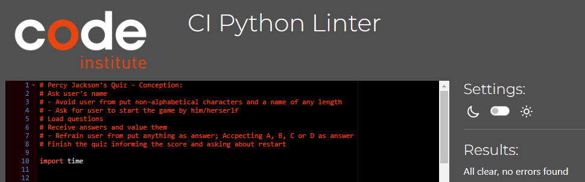

# PERCY JACKSON'S QUIZ

"Howling Books" is a podcast of a fictional (werewolf) character who tells stories to werewolves pups around a fire at night in a forest as it is the role of a Galliard of the werewolves. His first saga recorded is Percy Jackson's story. This quiz is, then, a continuation of the "Howling Books" project, which aims to bring children's fantasy literature to people who have little time, ADHD, some visual impairment or who just prefer to listen to books. As the first project covered the Percy Jackson saga, the quiz today aims to build understanding and memory of books already recorded.

[Source](https://ui.dev/amiresponsive?url=https://percy-jackson-4c68baad7d9e.herokuapp.com/)

Visit the deployed site: [Percy Jackson's Quiz](https://percy-jackson-4c68baad7d9e.herokuapp.com/)

---

## CONTENTS

- [PERCY JACKSON'S QUIZ](#percy-jacksons-quiz)
  - [How to Play](#play)
  - [Technologies Used](#technologies-used)
    - [Languages Used](#languages-used)
    - [Frameworks, Libraries \& Programs Used](#frameworks-libraries--programs-used)
  - [Deployment](#deployment)
  - [Testing](#testing)
  - [Credits](#credits)
    - [Code Used](#code-used)
    - [Content](#content)
    - [Acknowledgments](#acknowledgments)

---

## How to Play

The game opens with the Howling Books symbol and greeting and asks for the user's name;

Then, it asks the user to start the game themselves;

The questions are loaded. There are 5 of them, with 4 possible options each;

The game receives the answers and evaluates them, but prevents the user from putting anything as a valid answer, accepting only A, B, C or D as an answer;

At the end of the quiz, it tells you your score and asks you to restart;

If the user aborts the restart, it shows a final message about following the author on Spotify, where he reads the books. 

## Technologies Used

### Languages Used

Only Python was used to create this project.

### Frameworks, Libraries & Programs Used

- Git - For version control.

- [Github](https://github.com/) - To save and store the files for the website.

- [Many Tools](https://manytools.org/hacker-tools/convert-images-to-ascii-art/go/) - To convert the wolf image to ASCII.

- [Conversor JPEG em WEBP](https://onlineconvertfree.com/pt/convert-format/jpeg-to-webp/).

- [Am I Responsive?](https://ui.dev/amiresponsive) To show the website image on a range of devices.

## Deployment

The site was deployed using Heroku - <https://percy-jackson-4c68baad7d9e.herokuapp.com/>

I followed the below steps when deploying my project to Heroku, based on the Code Institute instructions:

* Add to requirements.txt file:-
pip3 freeze > requirements.txt
Commit changes to Github:
git commit -m "Add requirements for deployment”

In HEROKU after creating the account:

1. "Create new App"

2. Give the App a unique name and enter region

3. Click on "Create App"

4. Click on "Settings" on your new App Dashboard

5. Scroll down to Config Vars where in my instance I only inserted KEY: PORT and VALUE: 8000 since I have no creds.json files to add.

6. Press Add-button

7. Scroll down to Buildpacks and press the icon for Python, click Save Changes, then press the icon for Nodejs and save changes. These Buildpacks need to be in below order:

Python 
NodeJS

8. Go to Deploy section tab and scroll down to Deployment Method. I connected to my Github pages and could thereafter search for my Github Repository "Parents Allowance Calculator" and then click connect.

9. Scroll down to Automatic and Manual Deploys sections. I clicked on Automatic Deployment so that my changes that I push to github automatically updates in Heroku.

10. Then in the Manual Deploy section, press Deploy Branch.

11. After project has been deployed successfully I clicked the View-button to see the program run in the terminal.

## AUTOMATED TESTING

The game prevents the user from puting non-characters as name, inputing an answer that's differ from A, B, C and D, as well proceeding without confirm it. It contains a score validation and the user has 2 types of final messages depending on his/her performance. Due to its simplicity, there are no known bugs.

The code has been tested by using [PEP8](https://pep8ci.herokuapp.com/).

## Credits

### Code Used

The idea for codes was based on the codes used in this Github project [Iury Rosal](https://github.com/iuryrosal/projetos-python/blob/main/level-a/01/quiz.py), but I made it different, once the pass criteria asks for something more deepful.

In order to help me making this more deepful, I used tips from professor João Lira, from [Hashtag Treinamentos](https://www.hashtagtreinamentos.com/).

The [Love Sandwiches project](https://github.com/Code-Institute-Solutions/love-sandwiches-p5-sourcecode/tree/master) also helped me a lot to fulfill the end of this project.

### Content

All the content for the quiz, such as Q&A and congratulations' message were written by myself and my husband Luís Eduardo H. de F. Pereira (Client/Owner).

This Readme was generated based on the Code Institute instructions [here](https://github.com/Code-Institute-Solutions/SampleREADME). For its sintaxe, the guidance from Github [here](https://docs.github.com/pt/get-started/writing-on-github/getting-started-with-writing-and-formatting-on-github/basic-writing-and-formatting-syntax#syntax). I also followed the instructions [here](https://github.com/kera-cudmore/readme-examples/blob/main/README.md). [Kera Cudmore](https://github.com/kera-cudmore) was a life-saver.

I also used [Grammarly](https://app.grammarly.com/) and [Deepl](https://www.deepl.com/translator) to proofread my content.

### Acknowledgments

I would like to acknowledge the following people:

[Martina Terlević](https://www.linkedin.com/in/martinaterlevic/) - My Code Institute Mentor. Hvala!

[Luís Eduardo H. de F. Pereira](https://www.linkedin.com/in/luis-pereira-9b425452/) - My beloved husband and best friend.

[Alexandre Costa](https://www.linkedin.com/in/costa-alex/) - an amazing friend that offered me guidance, feedback and interesting add-ons ideas to improve my project in the future.